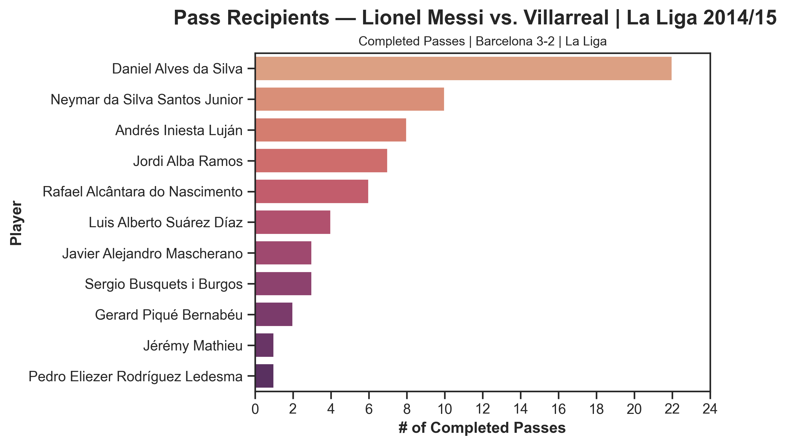
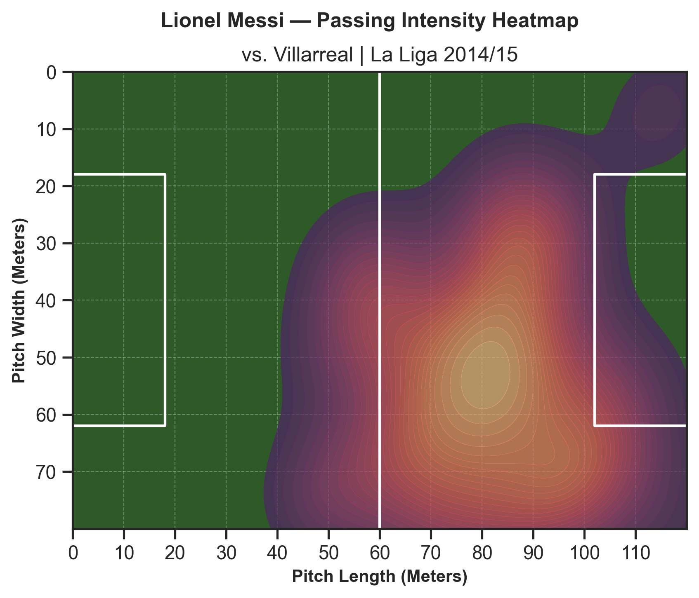
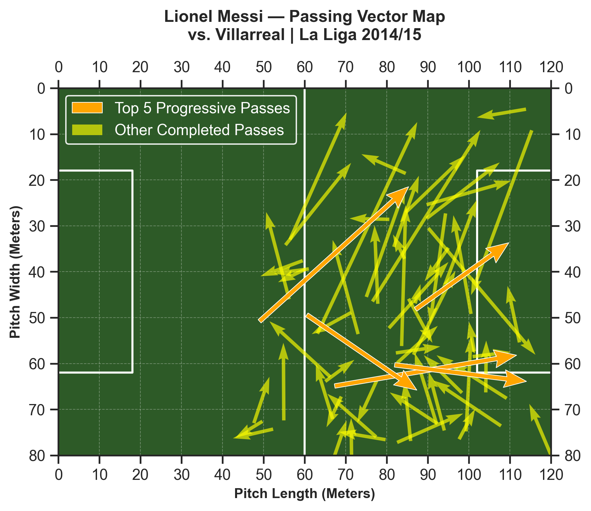

# La Liga Passing Efficiency — Spatial Analysis Pipeline

Analyzing Lionel Messi's passing during Barcelona vs Villarreal (2014/15 La Liga) using StatsBomb open data. The goal was to go beyond basic pass counts and build a scoring system that identifies which passes actually threatened the opponent's goal.

---

## What This Project Does

Most passing stats just count volume or measure how far forward a pass went. I wanted to build something more specific — a way to score each pass based on two things at once:

1. **How much territory it gained** down the pitch (longitudinal drive, ΔX)
2. **How much closer to goal it moved the ball** (Euclidean distance reduction to the goal center at coordinates (120, 40))

Combining these into a single progression score let me filter out routine possession recycling and isolate Messi's genuinely threatening passes.

---

## The Scoring Model

For each completed pass:

**Longitudinal Drive:**
$$\Delta X = end_x - start_x$$

**Distance to Goal (before and after):**

$$\text{Initial Distance} = \sqrt{(120 - start_x)^2 + (40 - start_y)^2}$$
$$\text{Terminal Distance} = \sqrt{(120 - end_x)^2 + (40 - end_y)^2}$$

**Absolute Drop:**
$$\text{Absolute Drop} = \text{Initial Distance} - \text{Terminal Distance}$$

**Final Progression Score:**
$$\text{Score} = \Delta X + \text{Absolute Drop}$$

### Score Context
- **Theoretical ceiling:** ~246.49 (a pass from (0,0) landing exactly on (120,40))
- **Match average:** 6.54 across all 67 completed passes
- **Top pass (Row ID 16):** 82.54 — about 12.6x the match average, confirming it as a genuine outlier rather than an arbitrary pick

---

## Visualizations

Three analytical views were built to break down Messi's passing:

**1. Pass Recipient Volume Chart**
A bar chart showing how frequently Messi passed to each teammate. Dani Alves came out as the primary outlet, which lines up with Barcelona's right-side overload pattern that season.



**2. Passing Intensity Heatmap (KDE)**
A 2D kernel density estimate showing where on the pitch Messi was releasing passes most frequently. The right half-space and final third dominate.



**3. Passing Vector Map**
All 67 completed passes plotted as vectors on a pitch. The top 5 scoring passes are highlighted in orange — everything else is faded. This makes the game-breaking passes immediately visible without any subjectivity.




---

## Key Finding

The highest scoring pass (score: 82.54) was a half-field diagonal that bypassed Villarreal's defensive shape entirely — ΔX of 44.3m and a distance drop of 38.2m toward goal. The model flagged it without any manual selection, which validated that the scoring approach was working as intended.

---

## Tech Stack

- **Python 3.10+**
- **Pandas** — data cleaning and feature engineering
- **NumPy** — vectorized distance calculations
- **Matplotlib** — vector field and pitch visualization
- **Seaborn** — KDE heatmap
- **Data:** StatsBomb Open Data

---

## How to Run

```bash
git clone https://github.com/Osaka17/messi_spatial_passing_optimization.git
cd messi_spatial_passing_optimization
pip install pandas numpy matplotlib seaborn
jupyter notebook messi.ipynb
```